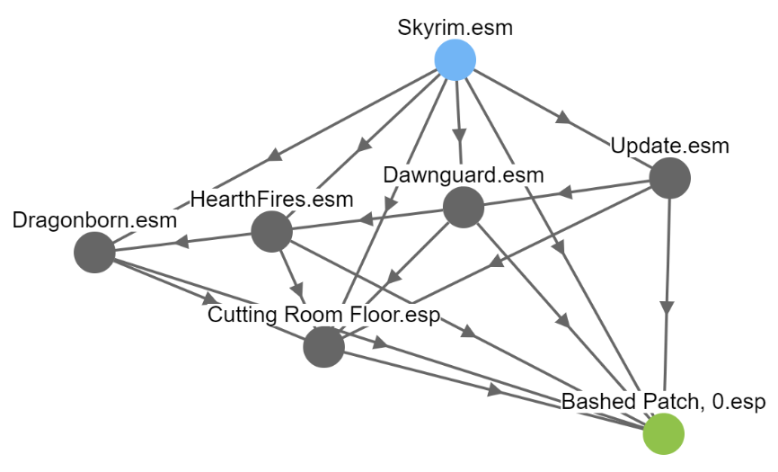
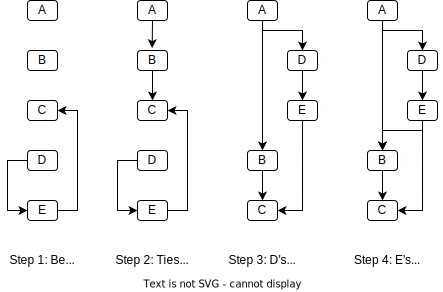

**********************
How LOOT Sorts Plugins
**********************

LOOT sorts plugins according to a set of rules that dictate how two plugins load
relative to one another. An example rule could be "``Cutting Room Floor.esp``
must load after ``Skyrim.esm``". LOOT derives rules from various data sources:
one source for the example rule could be the plugins' master flag fields:
``Skyrim.esm`` has its master flag set, and ``Cutting Room Floor.esp`` does not.
Another source could be the plugins' master fields: ``Cutting Room Floor.esp``
has ``Skyrim.esm`` as a master.

LOOT represents these rules in a graph, where each point (or *vertex*)
represents a plugin, and each line (or *edge*) joins two points, going from the
plugin that loads earlier to the plugin that loads later. Visualised, a simple
set of rules on a small load order looks like this:

It may seem like there are a lot of edges in that image, but a real load order
graph can contain thousands of vertices and over a hundred thousand edges.

To improve performance, LOOT actually sorts using two graphs: one for
master-flagged plugins and one for the other plugins, and then appends the
latter's sorted order to the former's sorted order to give the complete sorted
load order. The two graphs are sorted the same way, so the information below
applies to both, and the result is the same as if a single graph was used.

Building The Plugin Graph
=========================

The plugin graph is constructed in a specific way, partly to ensure that sorting
doesn't give you different results every time.

Hard Rules
----------

First the 'hard' rules, which **must** be followed, are applied. For each
plugin, going in lexicographical (like alphabetical, but extended to cover
digits and other symbols) order:

1. If the plugin has its master flag set, edges are added going from it to every
   other plugin that does not have its master flag set. Note that because
   plugins are partitioned into separate graphs by their master flag, this
   doesn't add any edges, but it's kept for completeness.
2. If the plugin has any masters, edges are added going from each of them to
   the plugin.
3. If the plugin has any requirements metadata, edges are added going from each
   required plugin to the plugin.
4. If the plugin has any "load after" metadata, edges are added going from each
   "load after" plugin to the plugin.

Some games, like the various versions of Skyrim and Fallout 4, hardcode the
positions of some plugins. To take this into account when sorting, LOOT adds
hard rules for them. For each plugin that has a hardcoded position, going from
the first/earliest hardcoded position to the last/latest position, an edge is
added between each consecutive plugin to enforce that order, and then edges are
added from the last hardcoded plugin going to every non-hardcoded plugin.

In the example graph image above, all the edges apart from the one between
``Cutting Room Floor.esp`` and ``Bashed Patch, 0.esp`` could be due to hard
rules:

- ``Skyrim.esm`` is a master of all the other plugins.
- ``Skyrim.esm``, ``Update.esm``, ``Dawnguard.esm``, ``HearthFires.esm`` and
  ``Dragonborn.esm`` are all hardcoded to load in that order.
- All of the  ``*.esm`` plugins have their master flag set, and both of the
  ``*.esp`` plugins do not have it set.

Group Rules
-----------

At this point, all hard rules have been applied. Group rules are applied next.
This part has the most complex logic, though the ideas behind it are relatively
simple. To summarise, each plugin belongs to a group, and groups can load after
other groups. If group C loads after group B, and group B loads after group A,
this means that all the plugins in group C load after all the plugins in groups
A and B.

However, group rules are 'soft' rules, so can be ignored to avoid cyclic
interactions. A cyclic interaction occurs when following the rules results in a
load order that loops back on itself, e.g. the two rules "B loads after A" and
"A loads after B" are cyclic. If one of those rules is a hard rule and the other
is a group rule, LOOT will ignore the group rule to avoid the cycle. There are
also a few other cases in which LOOT can avoid a cycle involving group rules,
which are detailed in :ref:`groups_editor`.

It's not always possible for LOOT to choose which plugin's group metadata to
ignore, and it's often impractical to know all of the hard and group rules that
a plugin may be involved in, so plugin grouping is a relatively common source of
cyclic interaction errors.

Anyway, after applying all the hard rules, LOOT applies all the group rules it
can for each plugin in lexicographical order, avoiding cycles by ignoring those
groups that it needs to.

In the example graph image above, the edge from ``Cutting Room Floor.esp`` to
``Bashed Patch, 0.esp`` is due to a group rule, because ``Bashed Patch, 0.esp``
is in a group that loads after ``Cutting Room Floor.esp``'s group.

Overlap Rules
-------------

Overlap rules are applied after group rules, and have lower priority. They are
also soft rules, and are ignored as necessary to avoid cyclic interactions. Two
plugins are said to overlap if they both contain a copy of a record, or if they
both load one or more BSAs (or BA2s for Fallout 4) and the BSAs loaded by one
plugin contain data for a file path that is also included in the BSAs loaded by
the other plugin. They don't necessarily have to make any edits to a record
for there to be an overlap, it just needs to be in both plugins. Similarly, the
assets loaded by the two plugins could be identical or completely different,
it's only the presence of the file path that matters.

If two plugins' records overlap, and one overrides more records than the other,
then the rule is to load the plugin that overrides fewer records after the other
plugin. Otherwise, if the two plugins' loaded assets overlap, the plugin that
loads more assets loads first. This is done to help maximise the effect that
each plugin has. If the two plugins override the same number of records and
load the same number of assets, the overlap is ignored and no rule exists.

Each pair of plugins is checked in lexicographical order for overlap, and all
overlap rules are applied, unless adding a rule would cause a cycle.

Morrowind plugins that have one or more masters that are not installed have
their total record count used in place of their override record count, as unlike
for other games, a Morrowind plugin's override records can only be counted by
comparing the plugin against its masters. Morrowind plugins also can't load
BSAs, so they can't have overlapping assets.

Tie Breaks
----------

At this point LOOT might be ready to calculate a load order from the graph, but
to ensure a consistent result, it needs to make sure there is only one possible
path through the graph that visits every plugin. For example, going back to the
image above, if there was no edge between ``Cutting Room Floor.esp`` and
``Bashed Patch, 0.esp``, the load order could be::

    Skyrim.esm
    ...
    Cutting Room Floor.esp
    Bashed Patch, 0.esp

or it could be::

    Skyrim.esm
    ...
    Bashed Patch, 0.esp
    Cutting Room Floor.esp

as there would be no way to decide which plugin to put last. This could mean
that LOOT's sorting would be inconsistent, maybe picking a different result each
time, which wouldn't be good.

To avoid this, LOOT first sorts the plugins into their current load order:

* If both plugins have positions in the current load order, the function
  preserves their existing relative order.
* If one plugin has a position and the other does not, the plugin with a
  position goes before the plugin without a position.
* If neither plugin has a load order position, a case-insensitive
  lexicographical comparison of their filenames without file extensions is used
  to decide their order. If they are equal, a case-insensitive lexicographical
  comparison of their file extensions is used.

Once sorted, LOOT tries to add an edge between each consecutive pair of plugins,
in an attempt to enforce the current load order.

* If adding the edge would cause a cycle, then the LOOT loops through each
  plugin in the existing path between the pair of plugins and pins its position
  relative to the plugins that have already been processed, before continuing
  with the next pair of plugins.
* If adding the edge wouldn't cause a cycle but the first plugin of the pair has
  already had its position pinned, then the second plugin of the pair has its
  position pinned too.
* Otherwise, the edge is simply added.

Here's a diagram showing plugins A, B, C, D and E, with that being their current
load order. Sorting has already added edges between (C, E) and (D, E) that
contradict the current load order:

Topological Sort
================

At this point the plugin graph is now complete. Before calculating a load order
from the graph, the graph is checked for cycles: if one is found, a sorting
error occurs. If no cycles are found, then the graph is topologically sorted,
which produces a path through the graph's vertices that visits each vertex
exactly once. This path is the calculated load order.

The topological sort of the example graph is::

    Skyrim.esm
    Update.esm
    Dawnguard.esm
    HearthFires.esm
    Dragonborn.esm
    Cutting Room Floor.esp
    Bashed Patch, 0.esp
