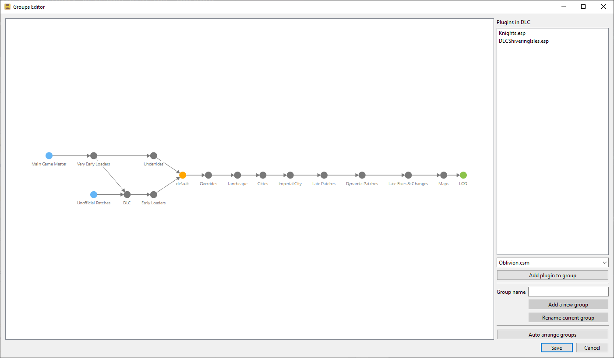

.. _groups_editor:

*********************
Editing Plugin Groups
*********************

What Are Plugin Groups?
=======================

LOOT assigns each plugin to one plugin group, with plugins belonging to the
``default`` group by default. Each group has a name and a list of zero or more
other groups it loads after. In this way, it's possible to concisely load groups
of plugins after other groups of plugins.

Group load order is transitive, i.e. given three groups A, B and
C, if C loads after B and B loads after A, then plugins in group C will load
after plugins in group A even if no plugins in group B are installed.

The Groups Editor
=================

A group must be defined before plugins can belong to it, and defining and
editing groups is done in the Groups Editor, which can be accessed through the
Game menu.

The groups editor consists of an interactive graph displaying all defined groups
and their load after metadata, and a sidebar containing input for defining new
groups, renaming the currently selected group, a list of plugins in the
currently selected group and a dropdown combo box for adding plugins to the
currently selected group.

- Groups are displayed as circular nodes in the graph, labelled with their
  names.

  - Groups that load after no other groups are displayed in blue.
  - Groups that no other groups load after are displayed in green.
  - The ``default`` group is displayed in orange.

- Load after metadata is displayed as lines (edges/vertices) between nodes,
  pointing from the earlier group to the later group.
- Metadata defined in the masterlist is greyed out, while user-defined metadata
  is not.

If any group definitions reference another group that does not exist, the groups
editor will create the missing group as user metadata. This is to help when
there is user metadata that says the user-defined group B must load after the
masterlist-defined group A, but then group A is removed in a masterlist update.
In that case, just open up the groups editor and link group A back into the
graph as it was before.

New load after metadata can be added by double-clicking on one group node and
dragging a line from it to any other group nodes.

Clicking on a group will cause any installed plugins in that group to be listed
in the sidebar. Right-clicking the list will display a context menu that
contains an action to copy the listed plugin names to the clipboard.

Right-clicking a load after metadata line will remove that load after metadata,
and right-clicking a group will remove it. Masterlist metadata cannot be
removed. A group cannot be removed if any installed plugins belong to it.

The graph can be zoomed in and out of using your mouse's scroll wheel.
Left-clicking and dragging an empty space will move the whole graph, while
left-clicking and dragging a node will move it.

Rules For Using Groups
======================

The groups editor enforces a few rules:

- A group cannot load after itself.
- A group cannot load after another group if the other group does not exist.
- It's not possible to delete groups that are defined in the masterlist.
- It's not possible to remove 'load after' entries from a group if they were
  defined in the masterlist.

It's possible to define group relationships and memberships that would produce
a cyclic load order. A simple example is where group ``B`` loads after group
``A``, and group ``A`` loads after group ``B``.

A more complex example involving other types of metadata is where

- ``A.esp`` is in the ``early`` group
- ``B.esp`` is in the ``mid`` group
- ``C.esp`` is in the ``late`` group
- ``A.esp`` has ``C.esp`` as a master
- The ``late`` group loads after the ``mid`` group, which loads after the
  ``early`` group.

A load order must be linear, so where group metadata is involved in a cycle,
LOOT will break the cycle by ignoring a plugin's group membership: in the
example above, ``C.esp``'s group membership would be ignored.

While not a strict rule, it's best to avoid defining cyclic group relationships
or assigning plugins to groups that would introduce cycles, to avoid surprising
sorting behaviour due to LOOT breaking those cycles.
