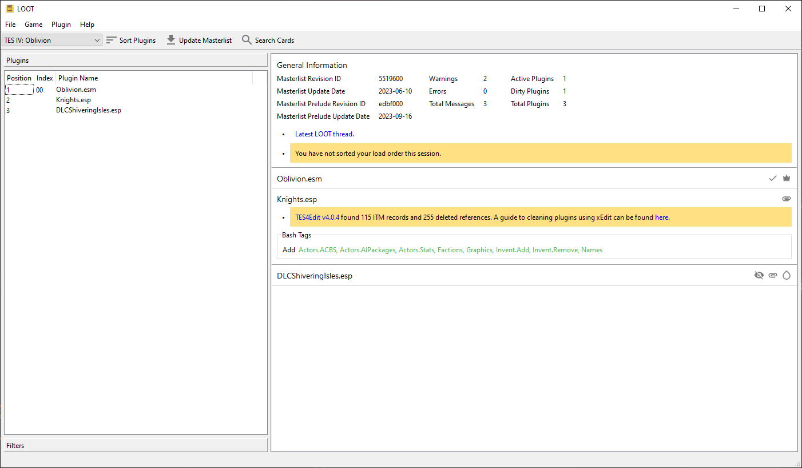

******************
The Main Interface
******************

The Menu Bar
============

The menu bar consists of the File, Game, Plugin and Help menus. Some menus and menu items are disabled when there is an unapplied sorted load order and while the metadata editor is open. If you're trying to use an option that is faded out, first close the metadata editor, or apply or discard a sorted load order. Additionally, the whole Plugin menu is disabled unless there is a plugin selected in the sidebar.

A few items in the menus are not self-explanatory:

- "Redate Plugins…" is provided so that Skyrim and Skyrim Special Edition modders may set the load order for the Creation Kit. It is only available for Skyrim, and changes the timestamps of the plugins in its Data folder to match their current load order. A side effect of changing the timestamps is that any Steam Workshop mods installed will be re-downloaded.
- "Copy Load Order" copies the displayed list of plugins and the decimal and hexadecimal indices of active plugins to the clipboard. The columns are:

  1. Decimal load order index
  2. Hexadecimal load order index
  3. Hexadecimal light plugin index
  4. Plugin name

- "Copy Content" copies the data displayed in LOOT's cards to the clipboard as YAML-formatted text.
- "Refresh Content" re-scans the installed plugins' headers and regenerates the content LOOT displays. This can be useful if you have made changes to your installed plugins while LOOT was open. Refreshing content will also discard any CRCs that were previously calculated, as they may have changed.
- The "Search Cards…" option allows you to search all the visible text displayed on plugin cards, so the results may be affected by any filters you have active. Searching can optionally be done using case-insensitive Perl-like regular expressions instead of case-insensitive text comparison.

The Toolbar
===========

The toolbar provides access to LOOT's main features: selecting a game, sorting plugins and updating the masterlist. These features get disabled while the metadata editor is open, so if you're trying to use an option that is faded out, first close the editor.

Game Menu
---------

LOOT's active game can be changed by clicking on it in the header bar, and selecting another game from the menu that is displayed. Games that have no install detected have their menu items disabled.

Masterlist Update & Sorting
---------------------------

The masterlist update process updates the active game's masterlist to the latest revision at the location given by the game's masterlist repository settings.

By :ref:`default <update-masterlist>`, sorting first updates the masterlist. LOOT then calculates a load order for your plugins, using their internal data and any metadata they may have. If a cyclic interaction is detected (eg. A depends on B depends on A), then sorting will fail.

Once LOOT has calculated a load order, it is compared with the current load order. If the current and calculated load orders are identical, LOOT will inform you that no changes were made via a status bar notification. If the calculated load order contains changes, the plugin cards are sorted into that order and the masterlist update and sorting buttons are replaced with Apply Sorted Load Order and Discard Sorted Load Order buttons, which apply and discard the calculated load order respectively. Changing games is disabled until the calculated load order is applied or discarded.

LOOT is able to sort plugins ghosted by Wrye Bash, and can extract Bash Tags and version numbers from plugin descriptions. Provided that they have the ``Filter`` Bash Tag present in their description, LOOT can recognise filter patches and so avoid displaying unnecessary error messages for any of their masters that may be missing.

Any errors encountered during sorting or masterlist update will be displayed on the "General Information" card.

Load Order Backups
^^^^^^^^^^^^^^^^^^

Before a sorted load order is applied, LOOT saves a backup of the current load order as a ``loadorder.bak.0`` text file in LOOT's data folder for the current game. Up to three load order backups are retained: ``loadorder.bak.0`` is the backup from the most recent load order change, ``loadorder.bak.1`` is the second-most recent backup, and ``loadorder.bak.2`` is the third-most recent backup.

Plugin Cards & Sidebar Items
============================

Each plugin is displayed on its own "card", which displays all the information LOOT has for that plugin, and provides access to plugin-specific functionality, including editing its metadata. Each plugin also has an item in the sidebar's Plugins section. The sidebar item contains the plugin's listed position, name and an |has_user_metadata_icon| icon for plugins that have user metadata. It also displays the plugin's in-game load order index if the plugin is active, while light plugins have their light plugin index displayed. Clicking on a plugin's sidebar item will select it, so that the Plugin menu options operate on it. Double-clicking a plugin's sidebar item will jump to its card.

The plugin card's header holds the following information, some of which is only displayed if applicable:

- The plugin name.
- The plugin's version number, extracted from its description field.
- The plugin's :abbr:`CRC (Cyclic Redundancy Checksum)`, which can be used to uniquely identify it. CRCs are only displayed after they have been calculated during overlap filtering or sorting, except the the CRC of the game's main master plugin, which is never displayed.
- The "Active Plugin" |active_plugin_icon| icon.
- The "Master Plugin" |master_plugin_icon| icon.
- The "Blueprint Master Plugin" |blueprint_master_plugin_icon| icon.
- The "Light Plugin" |light_plugin_icon| icon or "Small Plugin" |small_plugin_icon| icon.
- The "Medium Plugin" |medium_plugin_icon| icon.
- The "Empty Plugin" |empty_plugin_icon| icon.
- The "Loads Archive" |loads_archive_icon| icon.
- The "Verified clean" |verified_clean_icon| icon.
- The "Has User Metadata" |has_user_metadata_icon| icon.

.. |has_user_metadata_icon| image:: ../../../resources/icons/material-icons/account_circle_black_48dp.svg
  :scale: 45%

Messages, Bash Tag suggestions and plugin sources are displayed below the plugin card's header.

LOOT's plugin messages are a valuable resource, as they provide information that might not be obvious. It is important for a stable, healthy game that you act on any messages that require action. If you think a message suggests an unnecessary action, report it to an official LOOT thread. If you encounter a message that is non-conditional, ie. it suggests an action but is still displayed on subsequent runs of LOOT after the action has been carried out, also report it to an official LOOT thread, so that it can be made conditional.

You generally don't need to do anything with Bash Tag suggestions, so they're hidden by default. If you're using Wrye Bash it will automatically apply LOOT's suggestions, and if you're not using Wrye Bash then this information doesn't apply.

Plugin sources are obtained from location metadata, and don't necessarily reflect where you downloaded the plugin from. If multiple mods provide a plugin with the same filename, that plugin may be listed with links to where each of those mods are hosted.

Filters
=======

Clicking the Filters section header in the sidebar will replace the sidebar's plugin list with a list of filter toggles that can be applied to hide various combinations of plugins and other content. The available filter toggles are:

Hide version numbers
  Hides the version numbers displayed in blue next to those plugins that provide them.
Hide CRCs
  Hides the CRCs displayed in orange next to those plugins that provide them.
Hide Bash Tags
  Hides all Bash Tag suggestions.
Hide Sources
  Hides all plugin sources.
Hide notes
  Hides all plugin messages that have the Note: prefix, or the equivalent text for the language selected in LOOT's settings.
Hide official plugins' cleaning messages
  Hides all plugin cleaning messages for the current game's official plugins.
Hide all plugin messages
  Hides all plugin messages.
Hide inactive plugins
  Hides all plugins that are inactive.
Hide messageless plugins
  Hides all plugins that have no visible messages.
Hide Creation Club plugins
  Hides all plugins that are available through Bethesda's Creation Club.
Show only warnings and errors
  Combines the Bash Tags, sources, notes and messageless plugins filters. Enabling it enables those other filters, and disabling any of those other filters will also disable it.

The filter toggles have their states saved on quitting LOOT, and they are restored when LOOT is next launched. There are also three other filters in the sidebar tab:

Show only overlapping plugins for
  This filters the plugin cards displayed so that only plugins which modify the same game data records with this plugin will be visible. If this plugin loads an archive, other plugins that load archives which contain resources with the same file paths are also displayed. Sorting with the overlap filter active will first deactivate it.

Show only plugins in group
  This filters the plugin cards displayed so that only plugins in the selected group will be visible.

Show only plugins with cards that contain
  This hides any plugins that don't have the filter input value present in any of the text on their cards.

  The "Use regular expression" checkbox controls whether the input value is
  interpreted as text or as a regular expression. If ticked and the input value
  is not a valid regular expression, a tooltip detailing the issue will be
  displayed and the card content filter will be ignored.
