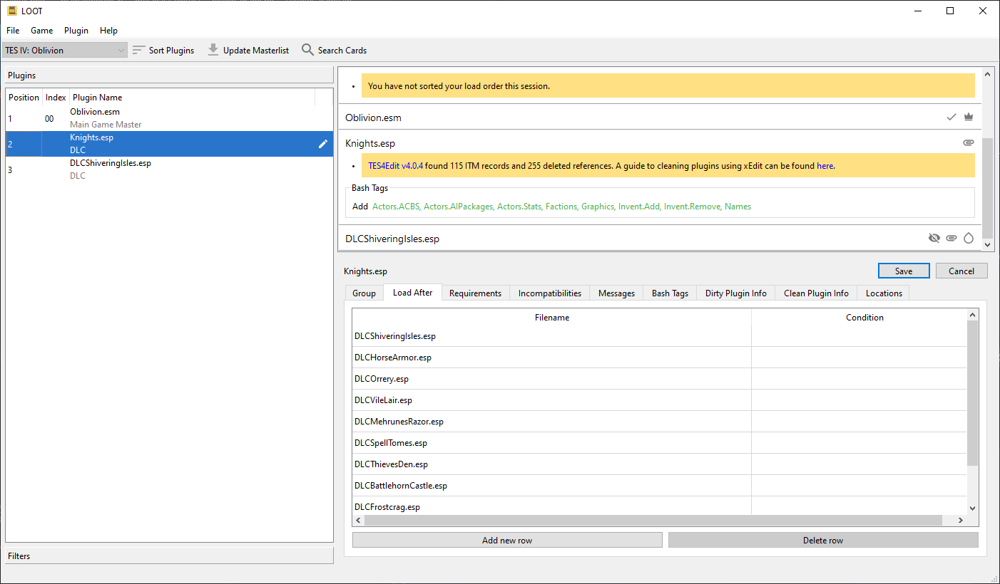

***********************
Editing Plugin Metadata
***********************

LOOT uses metadata to supply plugins with messages and Bash Tag suggestions, and to help it sort plugins that it can't otherwise sort correctly. You can add to your installed plugins' metadata through the metadata editor panel, and plugins with user metadata are indicated with a "Has User Metadata" |has_user_metadata_icon| icon.

.. |has_user_metadata_icon| image:: ../../../resources/icons/material-icons/account_circle_black_48dp.svg
  :scale: 45%

The editor panel is accessed by selecting a plugin in the sidebar and then clicking the "Edit Metadata" item in the Plugin menu. Only one plugin's metadata can be edited at a time. While the editor panel is open, the plugin sidebar also displays any non-default plugin groups, to aid setting new group memberships. The editor can be resized by grabbing the top of the editor's header and dragging it up or down.

The editor's header displays the name of the plugin being edited, "Save" and "Cancel" buttons, and a row of tabs.

The Group tab's page contains the "Group" dropdown, which sets the group that the plugin belongs to, and is set to the "default" group by default.

  Plugin groups are used to concisely load groups of plugins after others. The dropdown lists all defined groups: to define new groups or edit existing groups, use the Groups Editor.

The other tab pages contain metadata tables, which are detailed below. New rows can be added, and existing user-added rows can be removed, though rows containing metadata from the masterlist or from plugins cannot. Such non-user metadata rows are greyed out to indicate that they are not editable. The Load After, Requirements and Incompatibilities tables can have rows added by dragging and dropping plugins from the sidebar into the table area.

Load After
  This is a list of plugins which, if present, the current plugin must load after, but which are not required. This metadata can be used for resolving specific compatibility issues. Each entry has two fields:

  - The filename is the path, relative to the game's plugins folder (usually ``Data``), of the file to be checked for. This field is required. It gives the filenames of installed plugins as autocomplete suggestions.
  - The condition is the optional condition string that is used to determine if the file should be checked for. If left blank, the file will always be checked for. Condition strings are a relatively advanced part of LOOT's functionality, and their syntax is covered in the Metadata Syntax documentation.

Requirements
  This is a list of files that are required by the current plugin for it to function correctly. The current plugin will be loaded after any plugins listed. LOOT will also display an error message if any of the listed files are missing. Any file, not just plugins, can be listed here. Each entry has the same fields as for the load after table and two additional fields:

  - The display name is optional, and if specified will be used instead of the filename in any error messages that are displayed if a problem is encountered relating to the file.
  - The detail field takes a list of localisable message texts that will be appended to the error message if one is displayed.

  Note that listing a plugin's masters as requirements is unnecessary, as LOOT already checks them.

Incompatibilities
  This is a list of files that are incompatible with the plugin. LOOT will display an error message if any of the listed files are found. Any file, not just plugins, can be listed here, and each entry has the same fields as for the requirements table.

Messages
  A list of messages that are to be displayed for the plugin in LOOT's report. These have no bearing on a plugin's position in the load order. Each message has three fields:

  - The type is fairly self-explanatory, and is used to provide messages of varying severity with appropriate emphasis in LOOT's report.
  - The content is the localisable message text.
  - The condition is, like for the corresponding file field, used to determine if the message should be displayed. If left blank, the message is displayed.

Bash Tags
  A list of Bash Tags. These are used by Wrye Bash when generating a Bashed Patch, and are detailed in `Wrye Bash's readme`_. LOOT's metadata includes Bash Tag addition and removal suggestions, and any Bash Tags that came with the plugin are also displayed.

  As LOOT can suggest Bash Tags be added or removed, it is possible for the same Tag to appear twice, being suggested for addition and removal. In such cases, removal overrides addition.

  Each Bash Tag has three fields:

  - The add/remove field determines whether the Tag is to be suggested for addition or removal.
  - The Bash Tag field is the actual Bash Tag name. The field gives autocomplete suggestions for Bash Tags that LOOT knows are supported for the current game.
  - The condition decides if the Tag is to be suggested or not. It functions as for files and messages.

  If a plugin's masters are missing, an error message will be displayed for it. Filter patches are special mods designed for use with a Bashed Patch that do not require all their masters to be present, and so any plugin with the Filter tag applied and missing masters will not cause any errors to be displayed.

Dirty Plugin Info
  A list of dirty plugin CRCs and related information. Each row has six fields:

  - The CRC of the dirty plugin.
  - The ITM Count for the dirty plugin.
  - The number of Deleted References that the dirty plugin contains.
  - The number of Deleted Navmeshes that the dirty plugin contains.
  - The name of the Cleaning Utility to use to clean the dirty plugin.
  - A localisable detail message text.

  LOOT uses the information supplied to construct a warning message for the plugin if it matches any of the given CRCs.

Clean Plugin Info
  A list of clean plugin CRCs and the utility they were verified clean by. Each row has two fields:

  - The CRC of the clean plugin.
  - The name of the Cleaning Utility to use to verify that the plugin is clean.

  LOOT uses the information supplied to display an icon on the plugin's card if it matches any of the given CRCs.

Locations
  A list of URLs that the mod to which the plugin belongs can be found at. LOOT displays these as source hyperlinks on the plugin's card. Each location has two fields:

  - The URL at which the plugin's parent mod can be found.
  - The Name you wish to give the URL. If given, LOOT uses this as the text displayed for the hyperlink on the plugin's card.

.. _Wrye Bash's readme: https://wrye-bash.github.io/docs/Wrye%20Bash%20Advanced%20Readme.html#patch-tags
