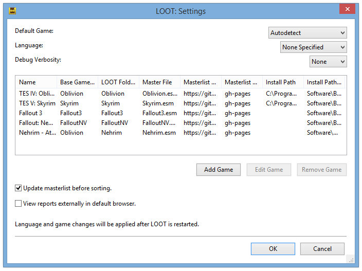

****************
Editing Settings
****************

LOOT's settings may be accessed through the main menu.

General Settings
================

.. _default-game:

Default Game
  If set to something other than Autodetect, this overrides game autodetection. If the game specified is not detected, LOOT falls back to autodetection.

Language
  Controls the language LOOT uses. Any plugin messages that do not have translations in the selected language will be displayed in English, if available, or in their available language otherwise.

Theme
  Controls the theme LOOT loads. If the specified theme is not found, LOOT falls back to the default theme.

Enable Debug Logging
  If enabled, writes debug output to ``%LOCALAPPDATA%\LOOT\LOOTDebugLog.txt``. Debug logging can have a noticeable impact on performance, so it is off by default.

.. _update-masterlist:

Update masterlist before sorting
  If checked, LOOT will update its masterlist, should an update be available, before sorting plugins.

Game Settings
=============

LOOT's game-specific settings can be customised in the games table. New game profiles can be added, making it easy to use LOOT across multiple copies of a game, including total conversion mods. LOOT ships with settings for the "Nehrim - At Fate's Edge" total conversion mod as an example. Game profiles can also be deleted, though the active game cannot have its profile deleted, and LOOT will recreate the profiles for the base games it supports (Morrowind, Oblivion, Skyrim, Skyrim Special Edition, Skyrim VR, Fallout 3, Fallout: New Vegas, Fallout 4 and Fallout 4 VR) when it is next run.

Name
  The name of the game, or another identifying text, that is displayed in menus and the LOOT's title bar.

Base Game Type
  Every game LOOT runs for must use the plugin file format and load order system of one of the following games:

  - TES III: Morrowind
  - TES IV: Oblivion
  - TES V: Skyrim
  - TES V: Skyrim Special Edition
  - TES V: Skyrim VR
  - Fallout 3
  - Fallout: New Vegas
  - Fallout 4
  - Fallout 4 VR

LOOT Folder Name
  The sub-folder which LOOT uses to store the game's files in. Each game must be given a unique sub-folder.

Master File
  The game's main master file. This is checked for when detecting if the game is installed.

Masterlist Repository URL
  The URL of the repository that LOOT uses to update its local copy of the masterlist. If left empty, masterlist updating will be skipped.

  Masterlist repositories are `Git`_ repositories that are configured to allow unauthenticated read access and contain a masterlist file named ``masterlist.yaml`` in their root directory. The LOOT team maintains a set of official repositories for the games that LOOT supports by default.

Masterlist Repository Branch
  The branch of the masterlist repository that LOOT should get masterlist updates from.

Install Path
  The path to the game's folder, in which the Data folder lies. Either this or a registry key must be supplied.

Install Path Registry Key
  The registry key, in ``HKEY_LOCAL_MACHINE``, that contains the install path of the game. This is used to obtain the install path if LOOT has no previous record of the game's install path, or LOOT's stored install path is invalid. Either this or an install path must be supplied.

.. _Git: https://git-scm.com/
