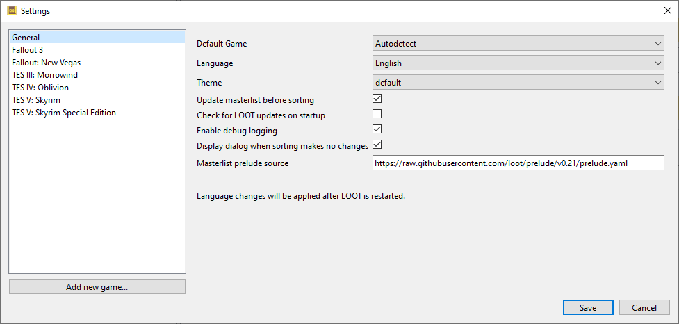
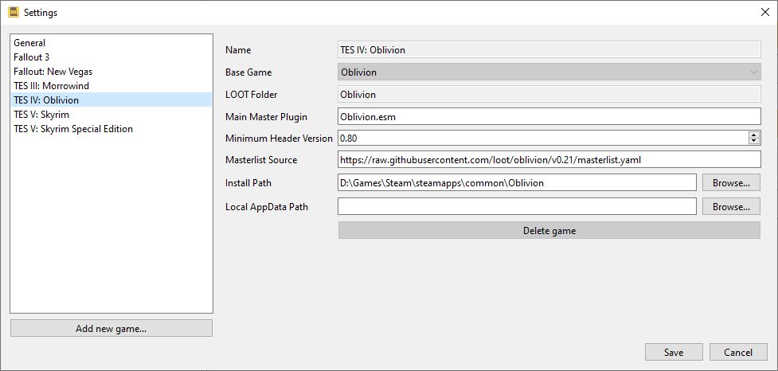

****************
Editing Settings
****************

LOOT's settings may be accessed through the File menu.

General Settings
================

.. _default-game:

Default Game
  If set to something other than Autodetect, this overrides game autodetection. If the game specified is not detected, LOOT falls back to autodetection.

Language
  Controls the language LOOT uses. Any plugin messages that do not have translations in the selected language will be displayed in English, if available, or in their available language otherwise.

Theme
  Controls the theme LOOT loads. If the specified theme is not found, LOOT falls back to the default theme.

.. _update-masterlist:

Update masterlist before sorting
  If checked, LOOT will update its masterlist, should an update be available, before sorting plugins.

Check for LOOT updates on startup
  If checked, LOOT will check for updates on startup and display a general message if an update is available.

Enable Debug Logging
  If enabled, writes debug output to ``%LOCALAPPDATA%\LOOT\LOOTDebugLog.txt``. Debug logging can have a noticeable impact on performance, so it is off by default.

Masterlist prelude source
  The URL of a masterlist prelude file that LOOT uses to update its local copy of the masterlist prelude.

Game Settings
=============

LOOT's game-specific settings can be customised by selecting a game in the sidebar. New game profiles can be added, making it easy to use LOOT across multiple copies of a game, including total conversion mods. Game profiles can also be deleted, though the active game cannot have its profile deleted, and LOOT will recreate default profiles for any games it detects when it is next run.

Name
  The name of the game, or another identifying text, that is displayed in menus and the LOOT's title bar.

Base Game
  Every game LOOT runs for must use the plugin file format and load order system of one of the following games:

  - Starfield
  - TES III: Morrowind
  - TES IV: Oblivion
  - TES V: Skyrim
  - TES V: Skyrim Special Edition
  - TES V: Skyrim VR
  - Fallout 3
  - Fallout: New Vegas
  - Fallout 4
  - Fallout 4 VR

LOOT Folder
  The sub-folder which LOOT uses to store the game's files in. Each game must be given a unique sub-folder.

Main Master Plugin
  The game's main master plugin. This is checked for when detecting if the game is installed.

Minimum Header Version
  LOOT will display a warning message for any plugin that has a header version less than this value. Note that this version is different from any version that LOOT may be able to read from the plugin's description field.

Masterlist Source
  The URL of a masterlist file that LOOT uses to update its local copy of the masterlist.

Install Path
  The path to the game's folder, in which the games executable and plugins folder (usually ``Data``) are found.

Local AppData Path
  The path to the game's local application data directory, which is usually in ``%LOCALAPPDATA%`` and for most games contains ``plugins.txt``. If left empty,
  LOOT will derive the path to use from the base game type.
